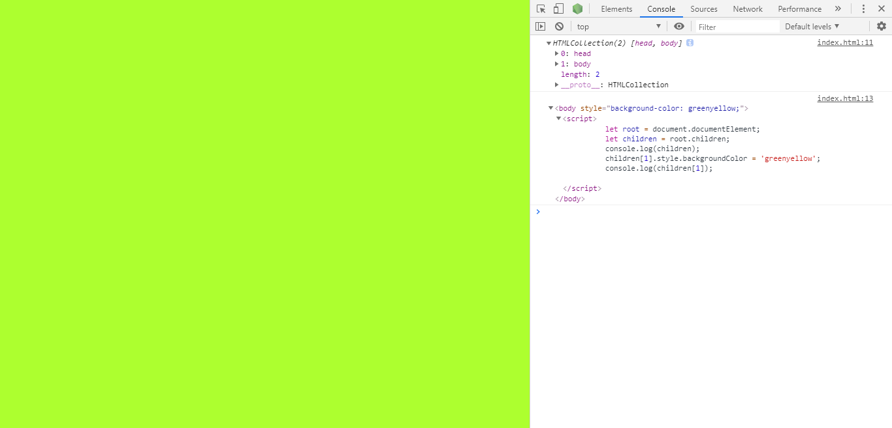

<!-- TOC -->

- [window.document对象实例](#windowdocument对象实例)
    - [返回焦点所在的元素](#返回焦点所在的元素)
    - [附加事件处理器至特定元素](#附加事件处理器至特定元素)
    - [收养特定节点](#收养特定节点)
    - [返回所有锚点元素构成的集合](#返回所有锚点元素构成的集合)
    - [返回当前网址的相关属性](#返回当前网址的相关属性)
    - [在当前网页中动态生成HTML源代码](#在当前网页中动态生成html源代码)
    - [内含特定服务器相关数据的cookie](#内含特定服务器相关数据的cookie)
    - [返回当前网页编码字符集的名称](#返回当前网页编码字符集的名称)
    - [创建代表新属性的节点](#创建代表新属性的节点)
    - [创建代表新注释的节点](#创建代表新注释的节点)
    - [创建代表新片段或新元素的节点](#创建代表新片段或新元素的节点)
    - [创建代表新文本的节点](#创建代表新文本的节点)
    - [返回当前网页的根元素](#返回当前网页的根元素)
    - [访问当前网址的域名](#访问当前网址的域名)
    - [返回所有embed元素构成的集合](#返回所有embed元素构成的集合)
    - [返回所有form元素实例构成的集合](#返回所有form元素实例构成的集合)

<!-- /TOC -->

# window.document对象实例

window.document对象实例，可被简写为document对象实例，即代表当前网页中的根节点实例，并且被内置了许多【处理各个后代节点实例】的属性和函数。

## 返回焦点所在的元素

属性`document.activeElement`可返回当前焦点所在的元素实例。

```html
<!DOCTYPE html>
<html lang="en">
<head>*/    <meta charset="UTF-8">
    <title>document activeElement</title>
    <style>
        input, button, select {
            font-size: 1.2em;
            margin: 5px;
        }
    </style>
</head>
<body>
    <form id="form01" name="form01" style="text-align: center;">
        <h3>个人资料</h3>
        <input type="text" id="username" name="username" placeholder="username" size="16" required>
        <input type="password" name="password" id="password" placeholder="password" size="16" required>
        <p></p>
        <section id="select01" name="select01">
            <option value="">choice of day-off</option>
            <option value="0">Sunday</option>
            <option value="1">Monday</option>
            <option value="2">Tuesday</option>
            <option value="3">Wednesday</option>
            <option value="4">Thursday</option>
            <option value="5">Friday</option>
            <option value="6">Saturday</option>
        </section>
        <input type="search" name="search" id="search" placeholder="job category" size="9">

        <p></p>
        <button type="submit" id="Login_btn">Login</button>
        <button type="reset" id="reset_btn">Reset</button>
    </form>
    <script>
        form01.onclick = function (event) {
            with(document.activeElement) {
                console.log(`Tag name = ${tagName}, id = ${id}`)
            }
        }
    </script>
</body>
</html>
```

## 附加事件处理器至特定元素

通过内置的全局函数`addEventListener()`,可在特定元素实例上，附加作为事件处理器的自定义函数。


## 收养特定节点

通过函数`document.adpotNode()`, 使得在当前网页中，特定节点实例会被收养到其他节点实例中，或者代表子网页的iframe元素实例里的节点实例中。

```html
<!DOCTYPE html>
<html lang="en">
<head>
    <meta charset="UTF-8">
    <title>documentadoptNode</title>
    <style>
        [id^=ul] {
            border-radius: px;
            color: royalblue;
            width: 100px;
            text-align: center;
            padding: 5px;
            list-style-type: none;
            background-color: gold;
            margin: 20px;
            display: inline-block;
        }
        #ul02 {
            background-color: goldenrod;
        }
    </style>
</head>
<body>
    <ul id="ul01">
        <li>apple</li>
        <li>blueberry</li>
        <li>cherry</li>
        <li>durian</li>
        <li>grape</li>
    </ul>
    <ul id="ul02">
        <li>banana</li>
    </ul>
    <script>
        let temp = null;
        function select_item(event) {
            temp = document.adoptNode(event.target);
            ul02.appendChild(temp);
        }
        ul01.addEventListener('click', select_item);
    </script>
</body>
</html>
```


## 返回所有锚点元素构成的集合

通过属性`document.anchors`, 可返回【在当前网页中，带有属性name而代表锚点】的所有a元素实例的集合。

## 返回当前网址的相关属性

在`window.document`对象实例中，存在多个可返回当前网址的多个属性，例如`documentURI`、`baseURI`、`URL`。此外，window.location.href亦可返回当前网址。

## 在当前网页中动态生成HTML源代码

通过函数`document.open()`、`document.write()`、`document.writeln()`、`document.close()`，可动态生成浏览器可执行的HTML源代码，成为网页里的源代码的一部分。

```javascript
document.open();
document.writeln('<hr color="green">');
document.write('<br>');
document.write('<div align="center">Time is money</ div>');
document.write('<br>');
document.writeln('<hr color="cyan">');
document.close();

document.body.style.backgroundColor = 'yellowgreen';
document.body.innerHTML += '<h1 style="color: royalblue; text-align: center">world peace...</ h1>';
console.log(document.body);
```

## 内含特定服务器相关数据的cookie

cookie是指网站服务器借助客户端的浏览器，存储于客户端的相关数据的小型文档，以便加速客户端日后和网站服务器的连接。

```html
<!DOCTYPE html>
<html lang="en">
<head>
    <meta charset="UTF-8">
    <title>document cookie</title>
</head>
<body>
</body>
<script>
    console.log(document.cookie);
    console.log('');
    let future_date = new Date();
    future_date.setTime(future_date.getTime() + 1 * 60 * 60 * 1000);
    document.cookie = 'username=jasper337';
    document.cookie = 'ip_address=111.222.333.444' + ' ;expires= ' + future_date.toUTCString();
    console.log(document.cookie);
    console.log('');

    document.cookie = 'username=; expires=Thu, 01 Jan 1970 00:00:00 GMT';
    document.cookie = 'ip_address=; expires = Thu, 01 Jan 1970 00:00:00 GMT';
    console.log(document.cookie);
</script>
</html>
```

## 返回当前网页编码字符集的名称

通过属性`document.characterSet`，可返回当前网页的编码字符集的名称。

`console.log(document.characterSet)`


## 创建代表新属性的节点

通过`document.createAttribute()`，可创建并返回【在特定元素实例中，代表新属性】的节点实例。

```javascript
let e01 = document.createElement('div');
e01.id = 'div01';
e01.innerHTML = 'A person who never made a mistake never tried anything new.';
e01.style.color = 'gold';
e01.style.backgroundColor = 'royalblue';
let a01 = document.createAttribute('title');
a01.value = 'word count = 11';
e01.setAttributeNode(a01);
document.body.appendChild(e01);
```

## 创建代表新注释的节点

通过函数`document.createComment()`，可创建 代表注释的节点实例。

```javascript
let c01 = document.createComment('This is the body for the main content.');
document.body.appendChild(c01);
console.log(document.body);
```

## 创建代表新片段或新元素的节点

通过函数`document.createDocumentFragment()`，可创建【随后可再被新增其他子节点】的片段的节点实例；通过函数`document.createElement()`，则可创建新的元素实例。

```javascript
let e01 = document.createElement('select');
let e02 = null;
e01.style.fontSize = '1.2em';
e01.style.marginTop = '10px';
let fruits = ['apple', 'banana', 'cherry', 'durian', 'guava'];
let f01 = document.createDocumentFragment();
for(let i = 0; i < fruits.length; i++) {
    e02 = document.createElement('option');
    e02.value = fruits[i];
    e02.textContent = fruits[i];
    f01.appendChild(e02);
}
e01.appendChild(f01);
document.body.appendChild(e01);
```

## 创建代表新文本的节点

通过函数`document.createTextNode()`，可创建代表新文本的节点实例。

```javascript
let e01 = document.createElement('div');
e01.id = 'div01';
let t01 = document.createTextNode('A person who never made a mistake never tried anything new.');
e01.appendChild(t01);
e01.style.color = 'gold';
e01.style.backgroundColor = 'royalblue';
let a01 = document.createAttribute('title');
a01.value = 'word count = 11';
e01.setAttributeNode(a01);
document.body.appendChild(e01);
```

## 返回当前网页的根元素

通过属性`document.documentElement`，可返回当前网页的根元素实例。当前网页的根元素实例，即是指当前网页中的html元素实例【<html>...</html>】。

```javascript
let root = document.documentElement;
let children = root.children;
console.log(children);
children[1].style.backgroundColor = 'greenyellow';
console.log(children[1]);
```

图片展示如下：


## 访问当前网址的域名

通过属性`document.domain`，可返回或者动态变更当前网页所在网站服务器的域名

`console.log(document.domain);`

## 返回所有embed元素构成的集合

通过属性`document.embeds`，可返回当前网页中的所有embed元素实例构成的集合。

```html
let embeds = document.embeds;
console.log(embeds);
console.log(embeds.length);
console.log(embeds[1].src);
````

## 返回所有form元素实例构成的集合

